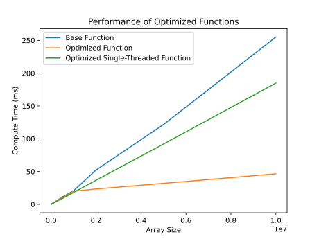

# Function Optimization

This example uses LLM-evo to optimize the performance of the following operation on a NumPy array:

$f(x)=\exp \left(\sin (x)+\cos ^2(x)\right)$

The baseline implementation (used as the seed for the evolutionary run) is the naive NumPy implementation:

```python
def baseline(x):
    return np.exp(np.sin(x) + np.square(np.cos(x)))
```

For a full description of the run and its results, please visit [my website](https://noerouizem.com/experiments/llm-evo-demo/).


